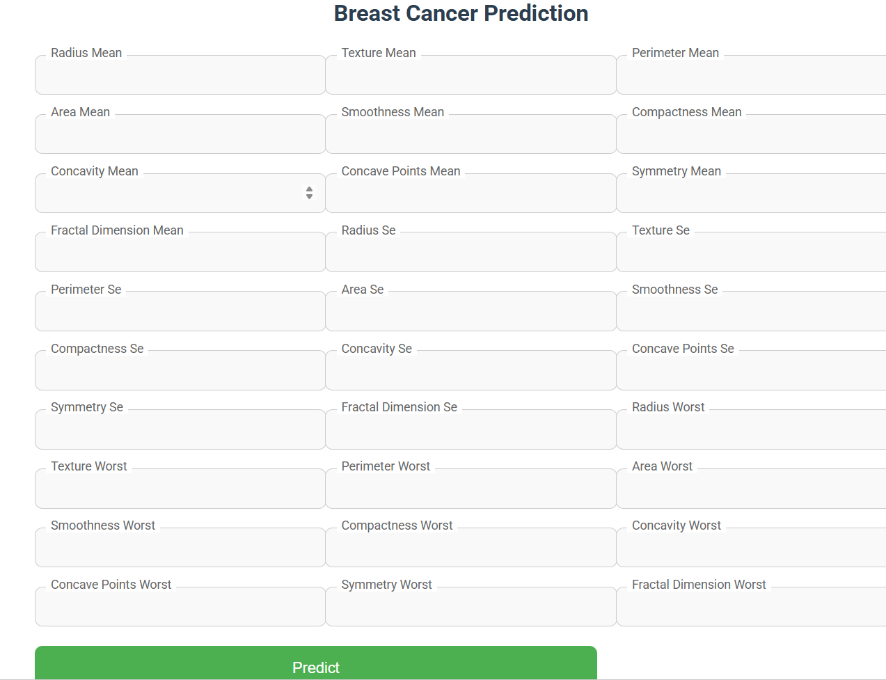

# 🩺 Breast Cancer Prediction Using Machine Learning

> An intelligent Machine Learning web application that predicts whether a breast tumor is **Benign** or **Malignant** using clinical diagnostic features, helping demonstrate the potential of AI in healthcare.

<p align="center">
  
  
  
  
  
</p>

---

# 📌 Overview

Breast cancer is one of the most common cancers affecting women worldwide. Early detection plays a crucial role in improving treatment outcomes and survival rates.

This project presents a **Machine Learning-based Breast Cancer Prediction System** that analyzes diagnostic features from the Wisconsin Breast Cancer Dataset to classify tumors as either:

- ✅ Benign
- ❌ Malignant

The trained model is integrated into a **Flask web application**, allowing users to enter diagnostic values and receive instant predictions through a simple and user-friendly interface.

---

# 🎯 Objectives

- Predict breast cancer accurately using Machine Learning.
- Assist in early diagnosis.
- Build an easy-to-use web application.
- Demonstrate complete Machine Learning deployment.
- Showcase practical use of AI in healthcare.

---

# ✨ Features

- Machine Learning Classification
- Real-Time Prediction
- Interactive Web Interface
- Flask Backend
- Trained Prediction Model
- Fast Response Time
- User-Friendly Design
- Easy Deployment

---

# 🛠️ Technologies Used

| Category | Technologies |
|----------|--------------|
| Programming Language | Python |
| Machine Learning | Scikit-learn |
| Web Framework | Flask |
| Data Analysis | Pandas, NumPy |
| Frontend | HTML, CSS |
| Development | Jupyter Notebook |

---

# 📊 Dataset

**Dataset Used**

- Wisconsin Breast Cancer Dataset

The dataset contains several diagnostic features extracted from breast mass images.

Target Classes:

- Benign
- Malignant

---

# 📁 Project Structure

```text
Breast-Cancer-Prediction-ML/
│
├── app.py
├── model.pkl
├── requirements.txt
├── README.md
├── .gitignore
│
├── dataset/
│   └── Breast Cancer Dataset.csv
│
├── notebook/
│   └── Breast_Cancer_Prediction.ipynb
│
├── reports/
│   ├── Project Report.pdf
│   └── Project Presentation.pptx
│
├── templates/
│
├── static/
│
└── images/
    ├── home.png
    ├── prediction.png
    └── result.png
```

---

# ⚙️ Installation

## Clone the repository

```bash
git clone https://github.com/yourusername/Breast-Cancer-Prediction-ML.git
```

## Navigate to the project folder

```bash
cd Breast-Cancer-Prediction-ML
```

## Install dependencies

```bash
pip install -r requirements.txt
```

## Run the application

```bash
python app.py
```

---

# 🚀 How to Use

1. Open the web application.
2. Enter the required diagnostic values.
3. Click **Predict**.
4. The model analyzes the data.
5. The application displays whether the tumor is **Benign** or **Malignant**.

---

# 🔄 Machine Learning Workflow

```text
Data Collection
       │
       ▼
Data Preprocessing
       │
       ▼
Feature Selection
       │
       ▼
Model Training
       │
       ▼
Model Evaluation
       │
       ▼
Model Serialization
       │
       ▼
Flask Integration
       │
       ▼
Prediction
```

---

# 📸 Screenshots

## Home Page

> Add a screenshot here.

```
## 📸 Home Page

## 📸 Home Page


```

---

## Prediction Page

> Add a screenshot here.

```
images/prediction.png
```

---

## Result

> Add a screenshot here.

```
images/result.png
```

---

# 📈 Future Enhancements

- Deep Learning Integration
- Explainable AI (XAI)
- Cloud Deployment
- User Authentication
- Medical Report Generation
- Improved User Interface
- REST API Support
- Model Performance Optimization

---

# 📚 Project Files

This repository includes:

- Machine Learning Source Code
- Flask Web Application
- Trained Model (`model.pkl`)
- Jupyter Notebook
- Dataset
- Project Report
- Project Presentation

---

# 🎓 Academic Purpose

This project was developed as part of a Bachelor of Technology (Computer Science & Engineering) academic project to demonstrate practical implementation of Machine Learning techniques in healthcare.

---

# 👨‍💻 Author

**Rohit Kumar**

**B.Tech – Computer Science & Engineering**

### Connect with Me

- GitHub: https://github.com/yourusername
- LinkedIn: https://www.linkedin.com/in/your-linkedin-username/

---

# ⭐ Support

If you found this project helpful, please consider giving it a **⭐ Star** on GitHub.

Your support is greatly appreciated!

---

## 📄 License

This project is intended for educational and research purposes.
